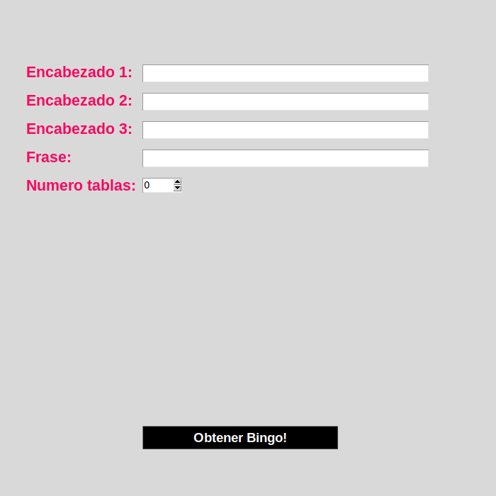
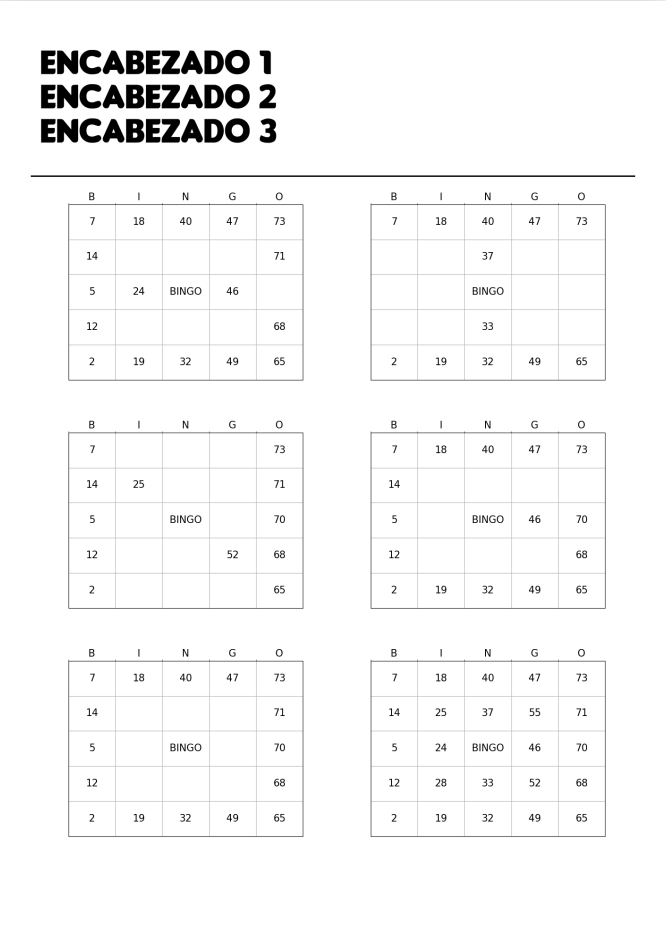

# BINGOOO!
**Version 1.0**

Este proyecto es un generador de Bingo con tablas versión Guayaquil, Ecuador.
Es uno de mis primerísimos proyectos, hecho para mi querida prima Milenky :D

El programa se puede ejecutar en:
- [x] Linux/Ubuntu
- [ ] Windows (**sin funcionar actualmente**)
- [ ] MacOS (**not tested**)

Para poder usarlo, es necesario tener instalado python 3 segun el sistema operativo:
- [Windows](https://phoenixnap.com/kb/how-to-install-python-3-windows)
- [Ubuntu](https://linuxize.com/post/how-to-install-pip-on-ubuntu-18.04/)

## Instalacion de dependencias (obligatorio antes de usar)
Para Windows:
```
pip install numpy matplotlib Pillow fpdf
```
Para Linux/Ubuntu:
```
sudo apt install python3-pip
pip3 install numpy matplotlib Pillow fpdf
sudo apt-get install python3-tk
```

## Ejecutar del programa
En Windows:
- Utilizando cmd.exe:
```
python main.py
```
- Dar doble click al archivo main.py

En Linux/Ubuntu:
- Abrir el terminal:
```
make
```

## Uso del programa
EL programa nos da la opcion de:
* Escribir 3 encabezados
* Escribir una frase (máximo 6 letras) que se dará la forma de las letras que hay en cada tabla del Bingo. (*PRECAUCIÓN:* no estan permitidos números, K, Ñ, V, Q)
* Determinar cuantas tablas queremos
Esta es la interfaz simple del programa:


Al darle click al botón, nos genera un archivo pdf con todas las tablas que determinamos junto a los encabezados y la frase.
El formato de cada tabla es el siguiente:


## Uso de tabla.py (solo para Linux/Ubuntu)
EL archivo tabla .py utiliza el decodificador (decoder.py) para mostrar una letra (excepto las K, tildes, Ñ, Q, V) en una matriz 5x5.
```
$ make run_tabla LETTER="C"
python tabla.py C
8 21 32 48 70
4 ## ## ## ##
13 ## ## ## ##
12 ## ## ## ##
5 17 37 58 63
```
